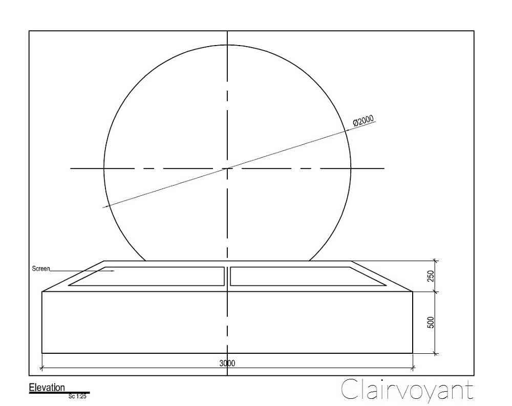
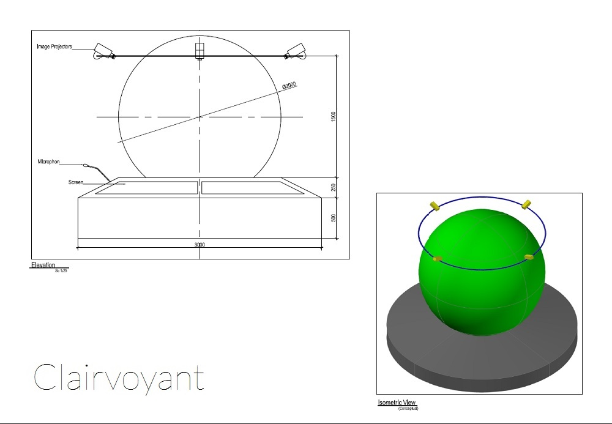

A concept diagram to help us visually illustrate the relationship between different ideas and how the ideas are put together to tell the whole story.

A more detailed concept diagram that shows a number of projectors at a certain elevation, projecting a rotating map to a stable solid sphere.

