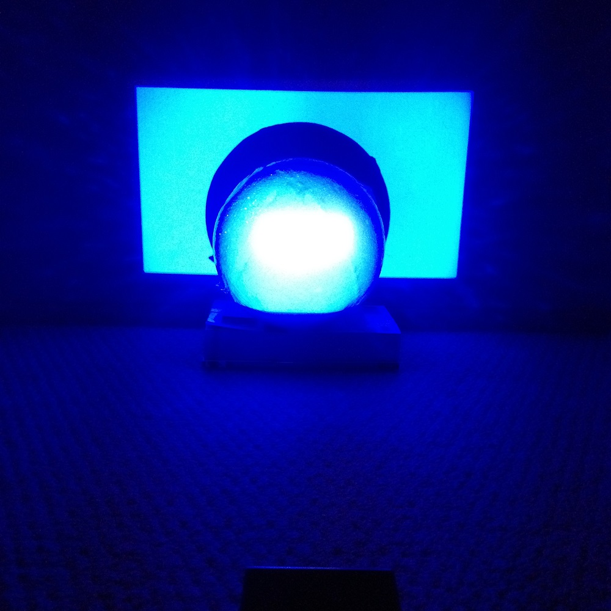
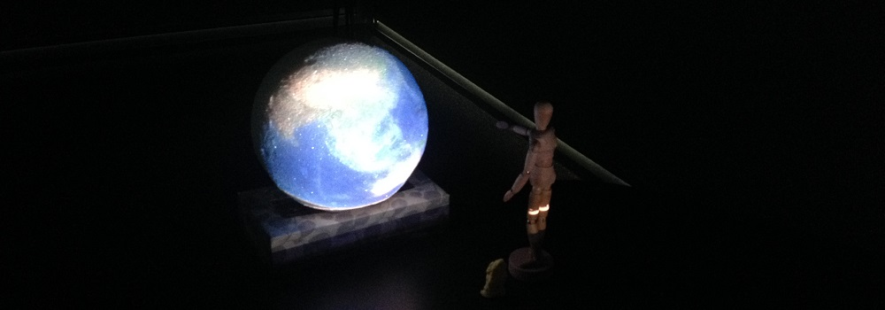
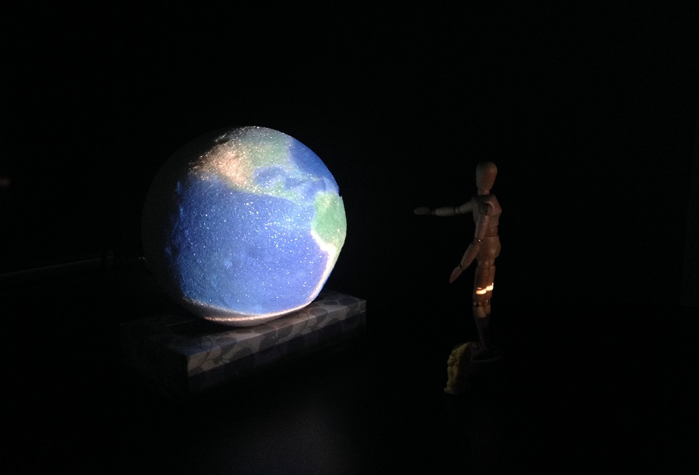
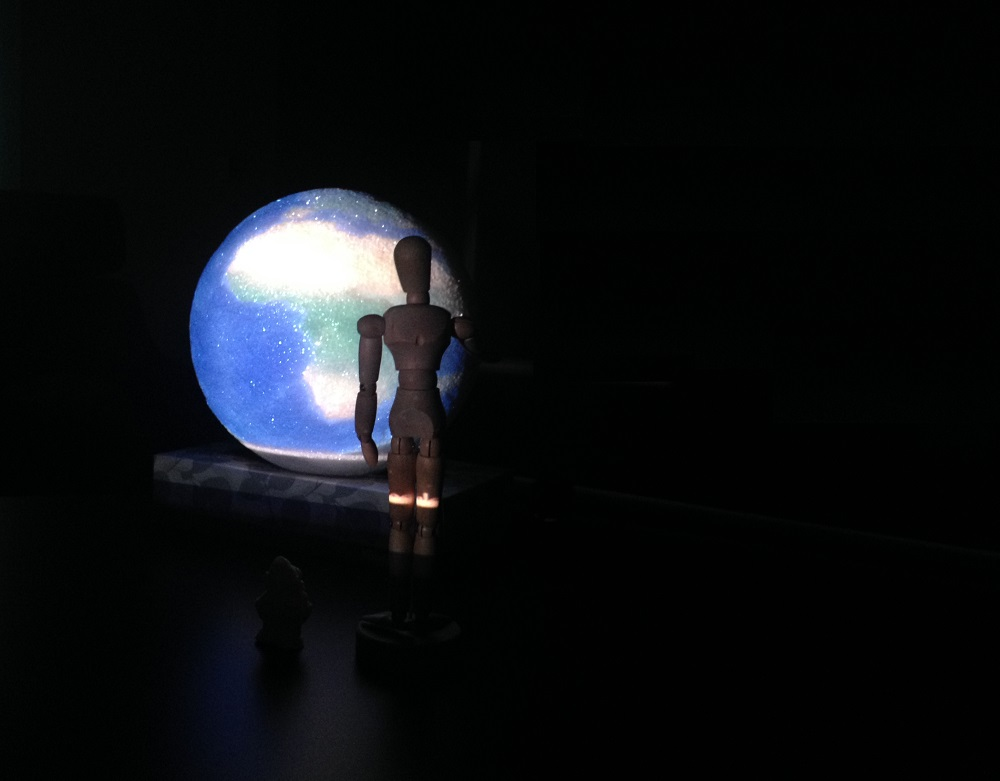
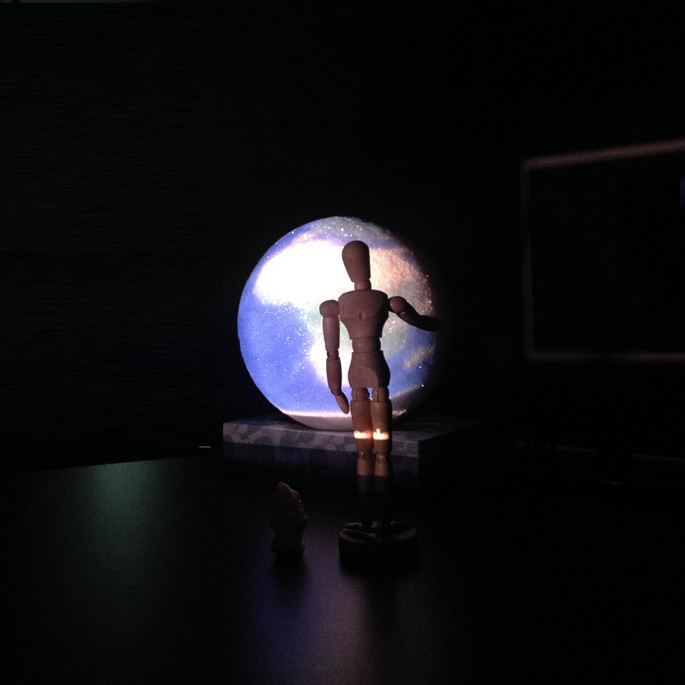
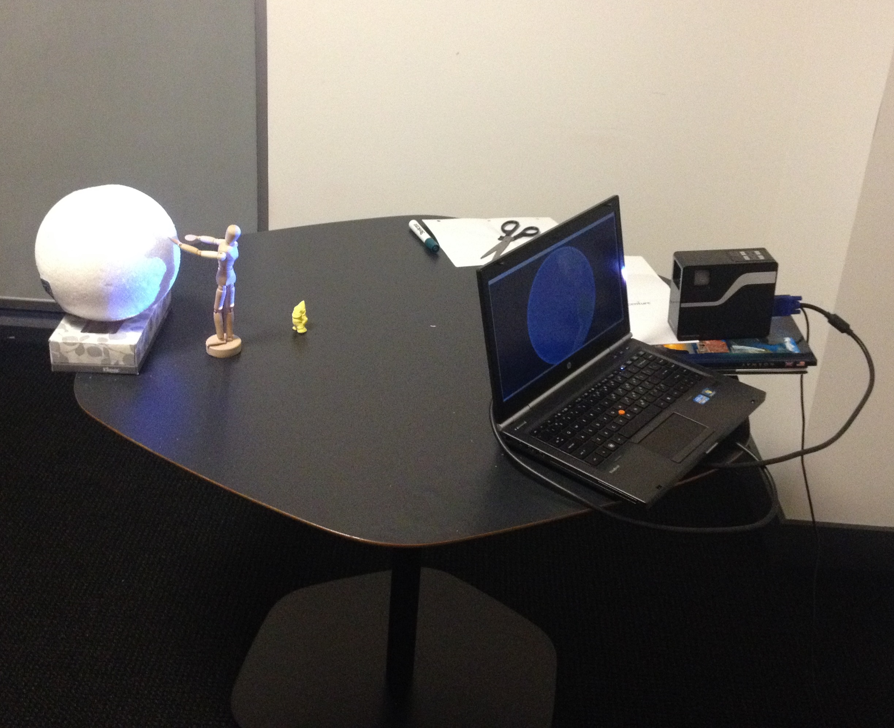

Yesterday the team created a sample prototype video to model the whole interaction. The prototype successfuly depicts the way the globe rotates, speech based commanding, navigation and the interaction with the user. Due to shortage of time the protoype didn't cover the display of cultural and racial content of the area that the user navigated. We plan to use google search API and wikipedia API to enlighten the user with content related to their search.
http://youtu.be/e2ldhG_skFg
Background music: Theme song, The Last of the Mohicans, by Dougie Maclean.
And few images captured in the process are down here:

