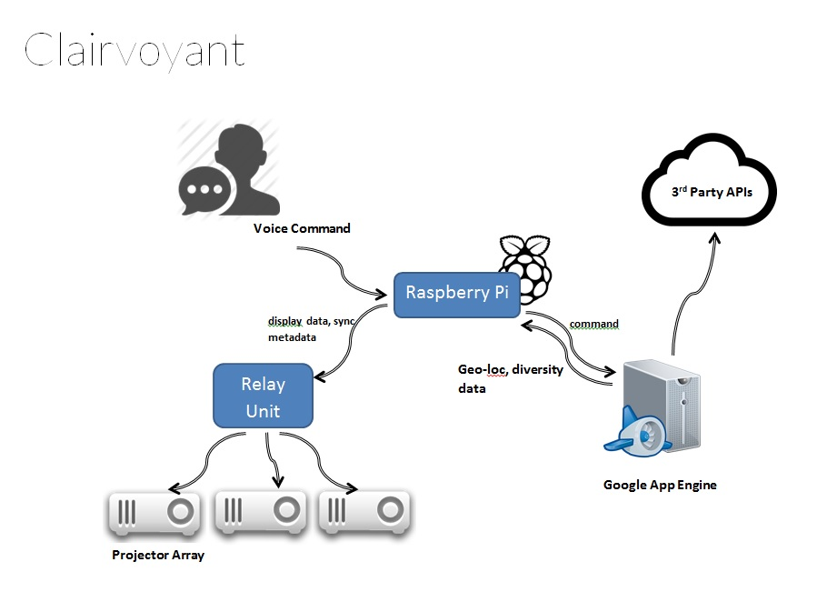

Yesterday the team discussed about the overall software/hardware architecture of the system. Raspberry Pi seemed to be an interesting solution to the problems dealing with sensors and audio input devices. A stronger backend system would be able to encode audio and make several API calls to other services and feed the Raspberry PI with geo-location data as well as related diversity data. The raspberry pi then would send display data and syncronization meta data to several projectors. A quick sketch of the whole system as of now might look as follows.
