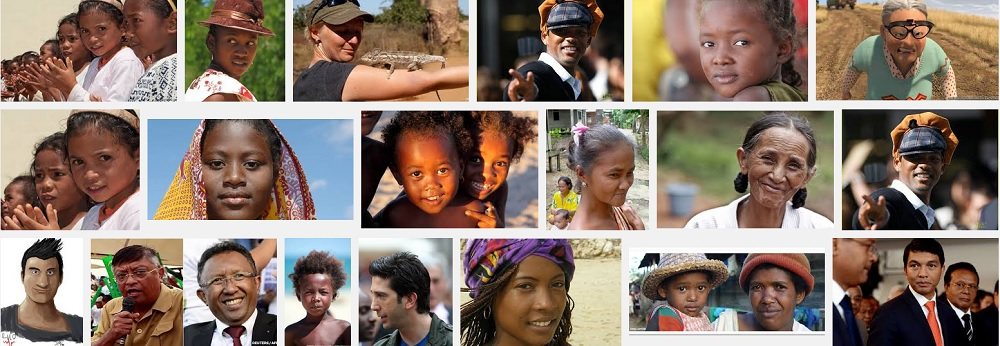

Forget about Raspberry Pi and synchronizing display between an array of projectors; we had an an insightful discussion on how to get diversity data. A user comes to the Clairvoyant and calls out "Madagascar". The sphere animates and zooms in to that region and the displays show culture/tradition/languages/race/diversity related to that area. So how do we get such data? Eventhough it's not a perfect solution we could approximate this feature by mashuping data from wikipedia API and google image search API and display the content in the screens below the sphere. Take a look:

```
curl "http://en.wikipedia.org/w/api.php?action=query&prop=images&format=json&imlimit=3&titles=madagascar" | python -mjson.tool
```

NOTE: Sample Java snippet for speech recognition.
```
{
    "query-continue": {
        "images": {
            "imcontinue": "18964|Andrianampoinimerina.jpg"
        }
    },
    "query": {
        "normalized": [
            {
                "from": "madagascar",
                "to": "Madagascar"
            }
        ],
        "pages": {
            "18964": {
                "pageid": 18964,
                "ns": 0,
                "title": "Madagascar",
                "images": [
                    {
                        "ns": 6,
                        "title": "File:Africa (orthographic projection).svg"
                    },
                    {
                        "ns": 6,
                        "title": "File:African Union (orthographic projection).svg"
                    },
                    {
                        "ns": 6,
                        "title": "File:All\u00e9e des Baobabs near Morondava, Madagascar.jpg"
                    }
                ]
            }
        }
    }
}
```

Google Image Search API with IMAGETYPE_FACES
```
curl "https://ajax.googleapis.com/ajax/services/search/images?q=Madagascar%20Faces&v=1.0" | python -mjson.tool
```

(truncated results)
```
{
    "responseData": {
        "results": [
            {
                "GsearchResultClass": "GimageSearch",
                "width": "3488",
                "height": "2616",
                "imageId": "ANd9GcRPwhUhwc3f3px7zIK31ZTMyqs0s2kmQmY0FkIVoCW6wDuNehGxkURRVJg",
                "tbWidth": "150",
                "tbHeight": "113",
                "unescapedUrl": "http://global-travel-info.com/wp-content/uploads/2012/10/Madagascar-face-painting.jpg",
                "url": "http://global-travel-info.com/wp-content/uploads/2012/10/Madagascar-face-painting.jpg",
                "visibleUrl": "global-travel-info.com",
                "title": "Photo of the Week: <b>Madagascar Face</b> Painting - Global-",
                "titleNoFormatting": "Photo of the Week: Madagascar Face Painting - Global-",
                "originalContextUrl": "http://global-travel-info.com/photo-of-the-week-madagascar-face-painting.html/",
                "content": "<b>Madagascar Face</b> Painting; Nosy",
                "contentNoFormatting": "Madagascar Face Painting; Nosy",
                "tbUrl": "http://t2.gstatic.com/images?q=tbn:ANd9GcRPwhUhwc3f3px7zIK31ZTMyqs0s2kmQmY0FkIVoCW6wDuNehGxkURRVJg"
            },
            {
                "GsearchResultClass": "GimageSearch",
                "width": "1024",
                "height": "678",
                "imageId": "ANd9GcRqQyIm2-onuoLkT3DjARH1WtApzKS_XJewq_w6jE-BkJm_aSBZMSYyA1dS",
                "tbWidth": "150",
                "tbHeight": "99",
                "unescapedUrl": "http://gdb.voanews.com/7C871892-FEC3-4E76-B567-CD5E2F17D0AE_mw1024_n_s.jpg",
                "url": "http://gdb.voanews.com/7C871892-FEC3-4E76-B567-CD5E2F17D0AE_mw1024_n_s.jpg",
                "visibleUrl": "www.voanews.com",
                "title": "<b>Madagascar Faces</b> &#39;Silent Crisis&#39; as Political Impasse Continues",
                "titleNoFormatting": "Madagascar Faces &#39;Silent Crisis&#39; as Political Impasse Continues",
                "originalContextUrl": "http://www.voanews.com/content/madagascar-silent-crisis-political-impasse/1706886.html",
                "content": "FILE - <b>Madagascar&#39;s</b>",
                "contentNoFormatting": "FILE - Madagascar&#39;s",
                "tbUrl": "http://t2.gstatic.com/images?q=tbn:ANd9GcRqQyIm2-onuoLkT3DjARH1WtApzKS_XJewq_w6jE-BkJm_aSBZMSYyA1dS"
            }
        ],
        "cursor": {
            "resultCount": "3,130,000",
            "pages": [
                {
                    "start": "0",
                    "label": 1
                },
                {
                    "start": "28",
                    "label": 8
                }
            ],
            "estimatedResultCount": "3130000",
            "currentPageIndex": 0,
            "moreResultsUrl": "http://www.google.com/images?oe=utf8&ie=utf8&source=uds&start=0&hl=en&q=Madagascar+Faces",
            "searchResultTime": "0.28"
        }
    },
    "responseDetails": null,
    "responseStatus": 200
}
```



